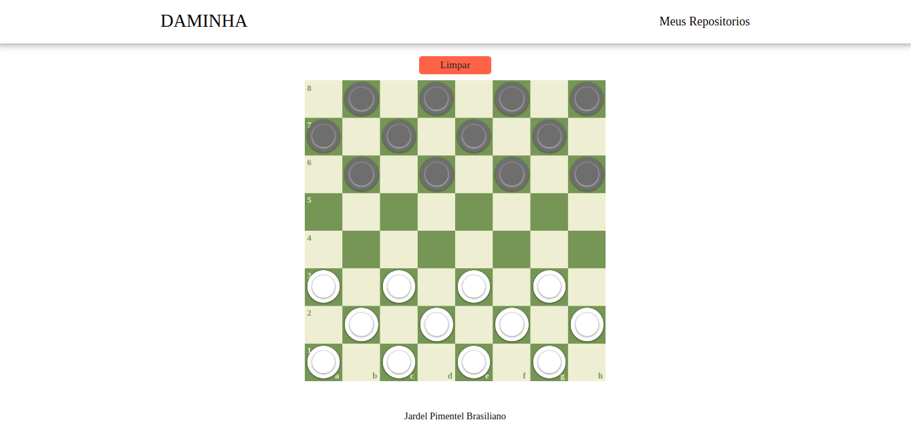
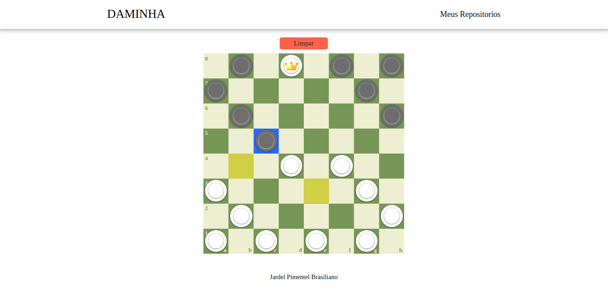
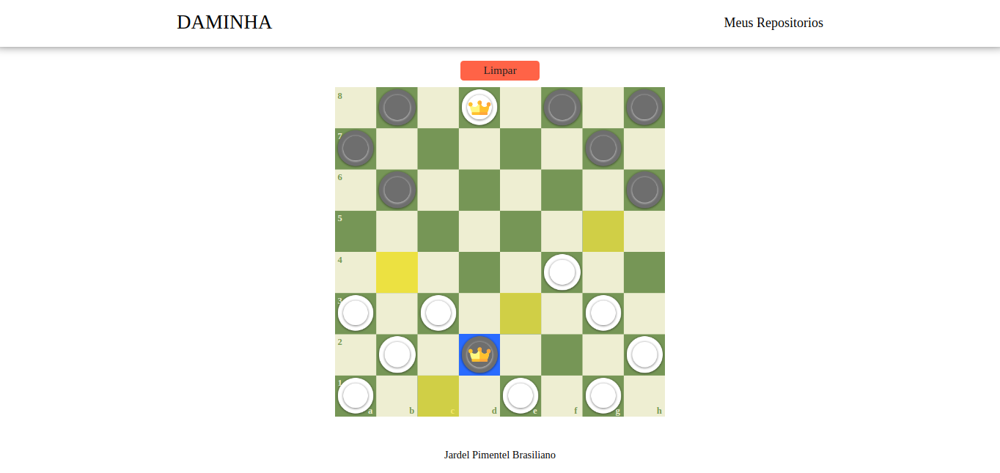

  <h1 style='font-size: 50px;'>Daminha</h1>

## Projeto

Jogo de dama.

## Tecnologias

Esse projeto foi desenvolvido utilizando as seguintes tecnologias:

- [React](https://reactjs.org/)
- [ContextApi](https://pt-br.reactjs.org/docs/context.html)

## O que falta

- [ ] Marcador de pontos.
- [ ] Controlar quem joga.

## Video

  

## Imagens

- Tela 01
  

- Tela 02
  

- Tela 03
  
